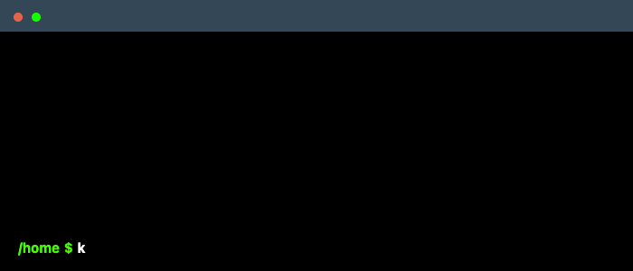

 

    

## Goals:
To architect robust cloud solutions through DevOps principles, leveraging GitOps methodologies and containerization to create efficient, scalable, and version-controlled infrastructure. I excel in collaborative environments, partnering with cross-functional teams to turn challenges into opportunities for growth and innovation.

## 🧰 Languages and Tools:

         

       

       

## Articles:
You can find my articles on Medium where I share my insights, tips, and my knowledge from my experience in tech. 

  

## Connect with me!
[![linkedin-shield]][linkedin]

## Visitors 👁:

 

 

<!-- Links -->
[linkedin]: https://www.linkedin.com/in/mauricio-quevedo-devops/
[linkedin-shield]: https://img.shields.io/badge/-linkedin-0078B6?logo=linkedin&logoColor=white&style=for-the-badge
 

